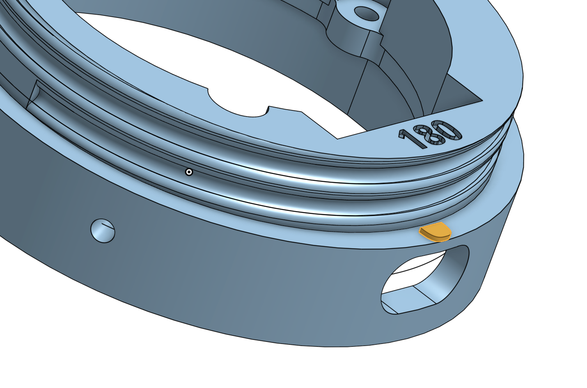

# Active LCD/Touch Module for MSA Millenium

[](https://youtube.com/shorts/RAXS9oAZ2nA)

* Turn on by plugging a powered UCB-C cable or pressing the PWR button through the "2 o'clock" hole with a paper clip.
* Select a screen by swiping left/right
* To select options, select the "VU Meter" screen, then swipe down
   * When "gimbal" mode is turned on, static images will stay vertical as the module is tilted left/right. For the gimbal to operate, the face of the module must be near vertical. If the module is tilted backward/forward, the image will revert to a static position until the module returns to a near-vertical position.
   * Select the desired screen brightnedd using the slider
   * Swipe up or down to exit the options screen. The selection options are saved to non-volatile storage and will be used the next time the module is powered up.
* To power off the module, select the "VU Meter" screen, then swipe up
   * Press and hold the button until the counter reaches "00:00", then release the button.

[](https://youtube.com/shorts/vYDvSj9ELww)

## Parts

To assemble your own module, you will need

1. 1 x [Waveshare ESP32-S3-Touch-LCD-1.85 module](https://www.waveshare.com/wiki/ESP32-S3-Touch-LCD-1.85)
2. 1 x [102040 3.7V Li-ion battery](https://www.aliexpress.com/item/3256802795997758.html)
3. 1 x [male MX1.25 2PIN wire connector](https://www.aliexpress.us/item/3256807090795780.html)
4. 3 x [M2x8 machine screws](https://www.amazon.com/cSeao-100pcs-Phillips-Machine-Stainless/dp/B0CMCRW6N5)
5. 1 x 3D printed adaptor

## 3D Printed Adaptor

The display must be physically mounted vertically on the mask, with the opening for the USB-C connector facing down.
This means that the thread must be such that, once tightly screwed in place, the display must end up in the
right orientation.

To that end, you will find twelve versions of the adaptor print files in the `adaptor/` directory. Each is suffixed with a number between 0 and 330, one for each 30-degree rotation of the thread. Further, there is a 0,5mm adjustment nib than can be filed down to get a tight fit at the right position.



To select the adaptor corresponding to your mask, locate where the thread starts. Measure the angle in degrees from the top of the opening in a clockwise direction. Select the file that is closest to your measurement. In the example pictured below, the thread starts at the bottom of the opening, thus `adaptor/Module Adaptor 180.stl` should be used.


## Assembly

1. Download and install [esptool](https://github.com/espressif/esptool/releases). How this is done depends on your computing platform and outside the scope of these instructions.

1. Download the latest `DroneModule-vXXX.bin` file from the `releases` directory.

1. Using a USB-C cable, connect the display module to your computer. Flash the device with the binary using the `esptool` command. How the command is issued depends on your computing platform and outside the scope of these instructions.

    ```
    $ esptool write-flash 0x0000 DroneModule-vXXX.bin
    ```

1. Solder the wire connector to the battery. Check the polarity of the connectors. Do not rely on the color of the wires as there are no standard as to which side should be positive or negative.

    

1. Attach the module to the adaptor using the three screws. Do not tighten the screws very much as this may cause the touchscreen to separate from the module body.

1. Connect the battery and put into the housing

    

1. Secure the battery with a strip of electrical tape. Bend the tape over the thread. There is plenty of room, it will help prevent the tape from peeling off, and help secure the module even more.


## Source Code

If you wish to modify the source code

1. Clone or fork this repository

1. Install [ESP-IDF](https://docs.espressif.com/projects/esp-idf/en/stable/esp32/index.html). How this is done depends on your computing platform and outside the scope of these instructions.

1. Update all the dependencies, compile, then flash the software in the module using a USB-C cable. Note that the USB-C opening is quite slim and a very low profile connector must be used.

    ```
    $ idf.py update-dependencies
    $ idf.py build flash
    ```

Contributions are welcomed! Please submit a Pull Request for consideration.